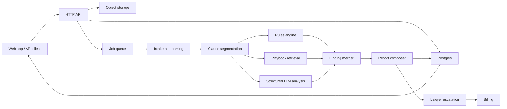

# Pocket Lawyer V2 Architecture

## Goal

Pocket Lawyer V2 should become an evidence-first contract analysis system for Indian users. The current MVP already proves the basic product loop:

1. ingest contract text
2. detect risky clauses
3. explain findings
4. suggest negotiation wording

The next version should improve quality, scalability, and trust without turning the project into an over-engineered legal chatbot.

## Design Principles

### 1. Modular monolith first

Do not split Pocket Lawyer into microservices yet. The product is still early, the workflows are tightly coupled, and correctness matters more than infrastructure novelty.

Start with:

- one Python application
- one relational database
- one object store for uploaded files
- one worker queue for document-processing jobs

This is the best tradeoff for speed, maintainability, and future growth.

### 2. Evidence before generation

Every report should be grounded in:

- extracted clause text
- page and span metadata
- matched rule or playbook entry
- optional retrieved legal reference

The system should never rely on a free-form LLM answer without traceable evidence.

### 3. Rules stay in the system

The current rule-backed analyzer is a strength, not a temporary hack. Keep deterministic rules as:

- a fallback path
- an explainability layer
- a guardrail against hallucinated legal claims

### 4. Retrieval should be narrow

Do not start with a generic RAG chatbot. Retrieval should be clause-level and metadata-aware. LegalBench-RAG suggests precise retrieval of minimal relevant text, not large noisy chunks.

### 5. Evaluation is a product feature

Pocket Lawyer should be benchmarked like a legal system, not only demoed like a startup prototype.

## Why This Design

The recommended design follows a few strong signals from research and existing projects:

- CUAD shows contract review works best when systems identify important clause spans rather than only generating an answer.
- ContractNLI shows evidence selection and long-document segmentation are hard and central.
- LegalBench-RAG shows retrieval quality depends on small, relevant passages.
- Docling provides strong open-source document conversion, OCR, and layout support.
- OpenAgreements is useful as a source of standard clause wording and templates, especially for suggested replacements.
- OpenContracts, now `cite`, is a useful reference for citation-aware legal data systems, but its citation graph is a later-stage capability, not a V2 requirement.

## Recommended High-Level Flow

## Module Breakdown

This breakdown is meant to be the most feasible migration path from the current repository.

### `src/pocket_lawyer/settings.py`

Responsibilities:

- environment variables
- feature flags
- model selection
- OCR backend selection
- storage configuration

Reason:

The current codebase has almost no configuration boundary. Add one before introducing external services.

### `src/pocket_lawyer/domain/`

Suggested files:

- `models.py`
- `enums.py`
- `contract_types.py`
- `risk.py`

Responsibilities:

- shared domain types
- risk levels
- contract type normalization
- report-level data contracts

Reason:

The current [models.py](../src/pocket_lawyer/models.py) and parts of [rules.py](../src/pocket_lawyer/rules.py) already behave like domain types. This should become the stable core.

### `src/pocket_lawyer/intake/`

Suggested files:

- `uploads.py`
- `extract.py`
- `pdf_text.py`
- `ocr.py`
- `docx.py`
- `normalize.py`

Responsibilities:

- file validation
- text extraction from TXT, PDF, DOCX, image files
- OCR fallback for scanned documents
- page-level text and metadata output

Reason:

The current [intake.py](../src/pocket_lawyer/intake.py) is a good MVP entry point, but V2 needs format-aware extraction and page provenance.

Recommended implementation path:

- V2.0: use Docling for structured conversion when possible
- fallback: direct text extraction for simple PDFs
- optional cloud OCR adapter for hard cases

### `src/pocket_lawyer/segmentation/`

Suggested files:

- `clauses.py`
- `headings.py`
- `spans.py`
- `heuristics.py`

Responsibilities:

- split extracted text into clause candidates
- preserve source spans
- attach page numbers and offsets
- classify headings and numbering structure

Reason:

This is the most important missing module in the current MVP. The existing analyzer works on whole text. Research and production systems both benefit from clause-level analysis.

### `src/pocket_lawyer/knowledge/`

Suggested files:

- `playbooks.py`
- `retrieval.py`
- `templates.py`
- `citations.py`

Responsibilities:

- legal clause playbook lookup
- metadata filtering by contract type, clause family, and jurisdiction
- template-backed replacement wording
- optional legal source references

Reason:

This replaces hardcoded legal knowledge in [rules.py](../src/pocket_lawyer/rules.py).

Recommended contents:

- clause family
- contract type
- risk level
- rule patterns
- explanation
- why it matters
- suggested replacement
- negotiation guidance
- jurisdiction note
- source reference
- escalation threshold

Important note:

Use standard templates and reviewed language where possible. OpenAgreements is a useful reference corpus for replacement wording and common structure, but Pocket Lawyer should not automatically present generated text as authoritative legal drafting.

### `src/pocket_lawyer/analysis/`

Suggested files:

- `rules_engine.py`
- `llm_engine.py`
- `retriever.py`
- `merger.py`
- `scoring.py`
- `report_composer.py`

Responsibilities:

- deterministic clause matching
- structured LLM reasoning over candidate clauses
- retrieval-assisted grounding
- deduplication and conflict resolution
- confidence scoring
- report assembly

Reason:

The current [analyzer.py](../src/pocket_lawyer/analyzer.py) should be split into smaller units once multiple analysis methods exist.

Recommended flow:

1. normalize contract type
2. segment clauses
3. run rules over each clause
4. retrieve matching playbook entries
5. run LLM only on risky or ambiguous clauses
6. merge findings
7. score and compose report

### `src/pocket_lawyer/llm/`

Suggested files:

- `client.py`
- `schemas.py`
- `prompts.py`
- `safety.py`

Responsibilities:

- model client setup
- Structured Outputs schemas
- prompt templates
- refusal and validation handling

Reason:

LLM logic should be isolated from domain logic. This keeps the rest of the system testable and reduces vendor lock-in.

Recommendation:

- use Structured Outputs
- do not rely on plain JSON mode
- use one schema for clause analysis and one for report augmentation

### `src/pocket_lawyer/storage/`

Suggested files:

- `db.py`
- `repositories.py`
- `object_store.py`
- `crypto.py`
- `audit.py`

Responsibilities:

- relational persistence
- file storage
- encryption helpers
- audit trail

Reason:

The current [storage.py](../src/pocket_lawyer/storage.py) is enough for local scan history, but not for privacy, multi-user support, or review workflows.

### `src/pocket_lawyer/api/`

Suggested files:

- `app.py`
- `schemas.py`
- `routes_contracts.py`
- `routes_reports.py`
- `routes_auth.py`
- `routes_reviews.py`
- `routes_billing.py`

Responsibilities:

- HTTP surface
- request validation
- authenticated endpoints
- asynchronous job creation

Reason:

The current [api.py](../src/pocket_lawyer/api.py) is fine for the MVP. V2 should move to a framework that is easier to maintain and extend.

Recommended direction:

- FastAPI if you want a pragmatic Python upgrade path
- preserve JSON contracts close to current report shapes

### `src/pocket_lawyer/vault/`

Suggested files:

- `contracts.py`
- `versions.py`
- `reminders.py`
- `sharing.py`

Responsibilities:

- per-user contract storage
- contract version comparison
- reminders for notice periods, renewals, and deadlines
- shareable report links or exports

Reason:

Vault features should stay separate from analysis logic.

### `src/pocket_lawyer/reviews/`

Suggested files:

- `requests.py`
- `matching.py`
- `briefing.py`
- `triage.py`

Responsibilities:

- lawyer review requests
- contract-type and region matching
- generating a pre-brief summary
- tracking review status

Reason:

Lawyer escalation is a workflow product, not a core analyzer concern.

### `src/pocket_lawyer/billing/`

Suggested files:

- `plans.py`
- `checkout.py`
- `webhooks.py`
- `entitlements.py`

Responsibilities:

- subscription plans
- one-time review purchases
- webhook verification
- feature gating

Reason:

Billing should not leak into core API logic.

### `src/pocket_lawyer/jobs/`

Suggested files:

- `queue.py`
- `workers.py`
- `contracts.py`
- `maintenance.py`

Responsibilities:

- background OCR
- extraction jobs
- report generation jobs
- cleanup and retries

Reason:

OCR and multipage parsing should not block a synchronous request path once the app handles larger files.

### `src/pocket_lawyer/evals/`

Suggested files:

- `datasets.py`
- `runner.py`
- `metrics.py`
- `goldens.py`

Responsibilities:

- benchmark execution
- regression testing
- clause extraction accuracy
- retrieval quality
- report consistency

Reason:

This is where Pocket Lawyer becomes a real legal-tech system instead of a UI demo.

## Suggested Data Model

### Core tables

- `users`
- `contracts`
- `contract_files`
- `document_pages`
- `clause_candidates`
- `playbook_entries`
- `findings`
- `reports`

### Workflow tables

- `lawyer_review_requests`
- `lawyer_profiles`
- `subscriptions`
- `payment_events`
- `audit_events`

### Sensitive content strategy

Store separately:

- metadata in plaintext columns where appropriate
- extracted text and full contract content encrypted at rest
- raw uploaded files in object storage

## RAG Decision

### Do we need RAG in V2?

Not as a full generic chatbot layer.

### What we do need

Start with:

- metadata filtering
- keyword retrieval
- clause-family retrieval
- contract-type filtering

This is enough for early playbook lookup.

### When to add vector retrieval

Add embeddings and vector search when:

- the playbook corpus becomes large
- jurisdiction notes grow
- retrieval quality drops with keyword-only search
- users need search across many saved contracts

Recommended approach:

- Postgres for primary data
- `pgvector` when vector retrieval becomes necessary
- hybrid keyword + vector retrieval rather than vector-only retrieval

## LLM Design

### Use LLMs for

- clause summarization
- clause classification when rules are inconclusive
- generating safer wording under constraints
- drafting negotiation messages from validated findings

### Do not use LLMs for

- raw source-of-truth legal conclusions
- unsupported citation generation
- report assembly without schema validation

### Recommended model contract

Input:

- clause text
- contract metadata
- retrieved playbook snippet
- rule findings

Output schema:

- clause summary
- risk label
- confidence
- supporting evidence span
- reason category
- replacement suggestion
- escalation recommendation

## OCR and Parsing Strategy

### Recommended order

1. direct text extraction when available
2. Docling structured conversion
3. OCR fallback for scans and photos
4. optional cloud OCR adapter for difficult enterprise documents

### Why

This gives the project a strong local-first path while still allowing a better hosted OCR option later if scan quality becomes a real product bottleneck.

## Migration From Current Code

### Keep and evolve

- [src/pocket_lawyer/analyzer.py](../src/pocket_lawyer/analyzer.py)
- [src/pocket_lawyer/intake.py](../src/pocket_lawyer/intake.py)
- [src/pocket_lawyer/models.py](../src/pocket_lawyer/models.py)
- [src/pocket_lawyer/rules.py](../src/pocket_lawyer/rules.py)

### First refactors

1. split `rules.py` into domain types plus playbook data loading
2. split `analyzer.py` into rules, scoring, and report composition
3. split `intake.py` into extraction adapters
4. move file-store logic out of `storage.py` into repositories

## Recommended Build Order

### Phase 6: Architecture foundation

- introduce settings
- introduce DB-backed repositories
- preserve current HTTP and CLI behavior

### Phase 7: Document pipeline hardening

- add DOCX and scanned PDF support
- add page-level extraction metadata
- add background jobs

### Phase 8: Clause segmentation and provenance

- add clause candidates
- add evidence spans
- show exact snippets in reports

### Phase 9: Legal playbooks

- move rules into structured playbook entries
- add jurisdiction notes
- add source references

### Phase 10: Hybrid analysis engine

- keep rules
- add structured LLM second-pass analysis
- add confidence and escalation

### Phase 11: Accounts and vault

- per-user auth
- encrypted contract storage
- report history and version comparison

### Phase 12: Lawyer review workflow

- review requests
- lawyer matching
- pre-brief summary generation

### Phase 13: Billing and entitlements

- subscription access
- one-time lawyer review payments
- webhook-backed entitlements

### Phase 14: Evaluation and release hardening

- benchmark suites
- golden report tests
- retrieval quality tests
- cost and latency budgets

## Explicit Recommendations

### Good ideas now

- clause segmentation
- data-driven playbooks
- structured outputs
- OCR with provenance
- benchmark-driven evaluation
- modular monolith

### Good ideas later

- vector retrieval
- citation graph
- large template catalogs
- multilingual support

### Avoid for now

- microservices
- agent swarms
- end-to-end fine-tuning before playbooks and evals are mature
- generic legal chatbot positioning

## References

- [CUAD: An Expert-Annotated NLP Dataset for Legal Contract Review](https://arxiv.org/abs/2103.06268)
- [CUAD dataset page](https://www.atticusprojectai.org/cuad/)
- [ContractNLI: A Dataset for Document-level Natural Language Inference for Contracts](https://arxiv.org/abs/2110.01799)
- [LexGLUE: A Benchmark Dataset for Legal Language Understanding in English](https://arxiv.org/abs/2110.00976)
- [LegalBench-RAG: A Benchmark for Retrieval-Augmented Generation in the Legal Domain](https://arxiv.org/abs/2408.10343)
- [Docling Technical Report](https://arxiv.org/abs/2408.09869)
- [Docling GitHub](https://github.com/docling-project/docling)
- [OpenAI Structured Outputs](https://platform.openai.com/docs/guides/structured-outputs)
- [pgvector](https://github.com/pgvector/pgvector)
- [Open-Source-Legal/OpenContracts (`cite`)](https://github.com/Open-Source-Legal/OpenContracts)
- [OpenAgreements](https://github.com/open-agreements/open-agreements)
- [Azure AI Document Intelligence overview](https://learn.microsoft.com/en-us/azure/ai-services/document-intelligence/overview?preserve-view=true&view=doc-intel-3.1.0&viewFallbackFrom=form-recog-3.0.0)
- [Amazon Textract documentation](https://docs.aws.amazon.com/textract/)
